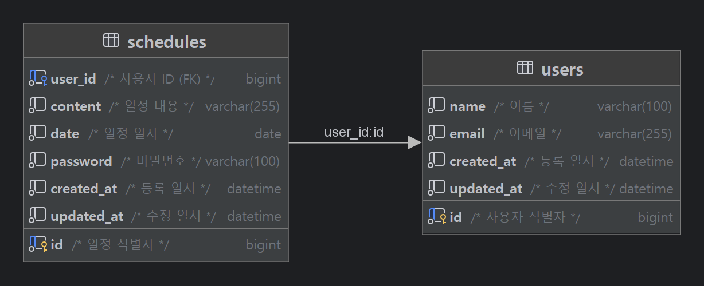

# 일정 관리 시스템

## 1. 프로젝트 개요
일정과 사용자를 관리하는 Spring boot 기반 API 서버  

## 2. 기술 스택
Java 17, Spring boot 3.4.4, JDBC Template, MySQL, Lombok, Gradle

## 3. 폴더 구조
```bash
task.schedule
├── controller
├── dto
├── entity
├── exception
├── repository
└── service
```

## 4. ERD


## 5. 기능 명세서

### 5.1. 사용자 (User)
#### 5.1.1. 사용자 등록
- 사용자는 이름(name)과 이메일(email)을 입력하여 등록할 수 있다.
- 빈 값은 허용되지 않으며, 이메일은 형식 검증을 거친다.
- 등록 시 생성일(createdAt)과 수정일(updatedAt)이 자동으로 기록된다.

#### 5.1.2. 사용자 조회
- 식별자(ID)를 기반으로 사용자 정보를 조회할 수 있다.
- 조회 결과에는 이름, 이메일, 생성일, 수정일이 포함된다.

#### 5.1.3. 사용자 수정
- 사용자 정보(이름, 이메일)를 수정할 수 있다.
- 하나만 수정하는 것도 가능하며, 이메일은 형식을 검증을 거친다.
- 수정된 내용이 없을 경우 204 No Content를 반환한다.
- 수정 완료 시 수정일이 갱신된다.

#### 5.1.4. 사용자 삭제
- 사용자 ID를 기반으로 삭제 요청을 보낼 수 있다.
- 존재하지 않는 사용자 삭제 시 예외가 발생한다.
- 사용자를 삭제할 때, 해당 사용자가 작성한 모든 일정도 함께 삭제된다.

### 5.2. 일정 (Schedules)
#### 5.2.1. 일정 등록
- 사용자 ID를 기반으로 일정을 등록할 수 있다.
- 등록 시 필수 입력 값:
    - 날짜(date): yyyy-MM-dd 형식
    - 일정 내용(content): 200자 이하
    - 비밀번호(password)
- 작성일(createdAt)과 수정일(updatedAt)은 자동으로 기록된다.
- 일정의 식별자(ID)는 자동 생성된다.

#### 5.2.2. 일정 목록 조회
- 사용자 ID를 기반으로 일정 목록을 조회할 수 있다.
- 조회 조건:
    - 필수: 사용자 ID
    - 선택: 수정일, 페이지 번호(기본값 1), 페이지 크기(기본값 5)
- 결과는 수정일 기준 내림차순 정렬된다.
- 전달받은 페이지 정보를 기반으로 페이지네이션이 적용된다.

#### 5.2.3. 일정 단건 조회
- 일정 식별자(ID)를 기반으로 일정 1건을 조회할 수 있다.
- 결과에는 작성자 이름, 날짜, 할일 내용, 생성일, 수정일이 포함된다.

#### 5.2.4. 일정 수정
- 일정 식별자(ID) 기반으로 일정을 수정할 수 있다.
- 수정 가능한 항목: 
  - 날짜(date): yyyy-MM-dd 형식
  - 일정 내용(content): 200자 이하
- 비밀번호가 일치해야 수정이 가능하다.
- 수정된 내용이 없을 경우 204 No Content를 반환한다.
- 수정 실패 또는 비밀번호 불일치 시 예외가 발생한다.
- 수정 성공 시 수정일이 갱신된다.

#### 5.2.5. 일정 삭제
- 일정 식별자(ID)와 비밀번호를 함께 전달하여 일정을 삭제할 수 있다.
- 비밀번호가 일치해야 삭제가 가능하다.
- 삭제 실패 또는 비밀번호 불일치 시 예외가 발생한다.

## 6. API 명세서

### 6.1. 사용자 등록 `POST`
#### request
- URL  
```
/users
```
- Body  
```json
{
    "name" : "spring",
    "email":"spring@gmail.com"
}
```
#### response `201 Created`
```json
{
    "id": 10,
    "name": "spring",
    "email": "spring@gmail.com",
    "createdAt": "2025-03-25T18:02:54",
    "updatedAt": "2025-03-25T18:02:54"
}
```

### 6.2. 사용자 조회 `GET`
#### request 
- URL
```
/users/{id}
```
#### response `200 OK`
```json
{
    "id": 10,
    "name": "spring",
    "email": "spring@gmail.com",
    "createdAt": "2025-03-25T18:02:54",
    "updatedAt": "2025-03-25T18:02:54"
}
```

### 6.3. 사용자 수정 `PATCH`
#### request 
- URL
```
/users/{id}
```
- Body
```json
{
    "name": "jdbc"
}
```
#### response `200 OK`
```json
{
    "id": 10,
    "name": "jdbc",
    "email": "spring@gmail.com",
    "createdAt": "2025-03-25T18:02:54",
    "updatedAt": "2025-03-25T18:09:28"
}
```

### 6.4. 사용자 삭제 `DELETE` 
#### request 
- URL
```
/users/{id}
```
#### response `204 No Content`

<br>

### 6.5. 일정 등록 `POST`
#### request
- URL
```
/schedules
```
- Body
```json
{
    "userId" : 5,
    "date": "2025-03-25",
    "content": "트러블 슈팅 작성",
    "password": "1234"
}
```
#### response `201 Created`
```json
{
    "id": 18,
    "userName": "java",
    "date": "2025-03-25",
    "content": "트러블 슈팅 작성",
    "createdAt": "2025-03-25T18:13:59",
    "updatedAt": "2025-03-25T18:13:59"
}
```

### 6.6. 일정 목록 조회 `GET`
#### request
- URL
```
/schedules?userId=2&updatedDate=2025-03-24&page=1&size=5
```
#### response `200 OK`
```json
[
  {
    "id": 16,
    "userName": "lee",
    "date": "2025-03-24",
    "content": "Task10",
    "createdAt": "2025-03-24T09:59:35",
    "updatedAt": "2025-03-24T09:59:35"
  },
  {
    "id": 15,
    "userName": "lee",
    "date": "2025-03-24",
    "content": "Task9",
    "createdAt": "2025-03-24T09:59:31",
    "updatedAt": "2025-03-24T09:59:31"
  },
  {
    "id": 14,
    "userName": "lee",
    "date": "2025-03-24",
    "content": "Task8",
    "createdAt": "2025-03-24T09:59:27",
    "updatedAt": "2025-03-24T09:59:27"
  },
  {
    "id": 13,
    "userName": "lee",
    "date": "2025-03-24",
    "content": "Task7",
    "createdAt": "2025-03-24T09:59:22",
    "updatedAt": "2025-03-24T09:59:22"
  },
  {
    "id": 12,
    "userName": "lee",
    "date": "2025-03-24",
    "content": "Task6",
    "createdAt": "2025-03-24T09:59:17",
    "updatedAt": "2025-03-24T09:59:17"
  }
]
```

### 6.7. 일정 단건 조회 `GET` 
#### request
- URL
```
/schedules/{id}
```
#### response `200 OK`
```json
{
    "id": 18,
    "userName": "java",
    "date": "2025-03-25",
    "content": "트러블 슈팅 작성",
    "createdAt": "2025-03-25T18:13:59",
    "updatedAt": "2025-03-25T18:13:59"
}
```

### 6.8. 일정 수정 `PATCH`
#### request 
- URL
```
schedules/{id}
```
- Body
```json
{
    "date": "2025-03-25",
    "content": "README 작성중...",
    "password" : "1234"
}
```
#### response `200 OK`
```json
{
    "id": 18,
    "userName": "java",
    "date": "2025-03-25",
    "content": "README 작성중...",
    "createdAt": "2025-03-25T18:13:59",
    "updatedAt": "2025-03-25T19:36:21"
}
```

### 6.9. 일정 삭제 `DELETE`
#### request
- URL
```
schedules/{id}
```
- Body
```json
{
  "password":"1234"
}
```
#### response `204 No Content`

---

## 7. 예외 처리
### 예외 코드 정의

| 예외 코드             | 응답 코드             | 메시지                              |
|----------------------|------------------------|--------------------------------------|
| VALIDATION_FAILED     | 400 Bad Request         | 입력 값이 유효하지 않습니다.        |
| INVALID_DATE_FORMAT   | 400 Bad Request         | 올바른 날짜 형식이 아닙니다.        |
| NOT_FOUND_USER        | 404 Not Found           | 사용자가 존재하지 않습니다.         |
| NOT_FOUND_SCHEDULE    | 404 Not Found           | 일정이 존재하지 않습니다.           |
| UPDATE_FAILED         | 404 Not Found           | 데이터 변경에 실패했습니다.         |
| DELETE_FAILED         | 404 Not Found           | 데이터 삭제에 실패했습니다.         |
| INVALID_PASSWORD      | 400 Bad Request         | 비밀번호가 일치하지 않습니다.       |
| NO_CHANGES            | 204 No Content          | 변경된 내용이 없습니다.             |
| RELOAD_FAILED         | 500 Internal Server Error | 데이터를 불러오는 데 실패했습니다. |

## 8. 구현 과정
[[내일배움캠프] 일정 관리 서버 트러블 슈팅 (작성중...)](https://withong.github.io/)